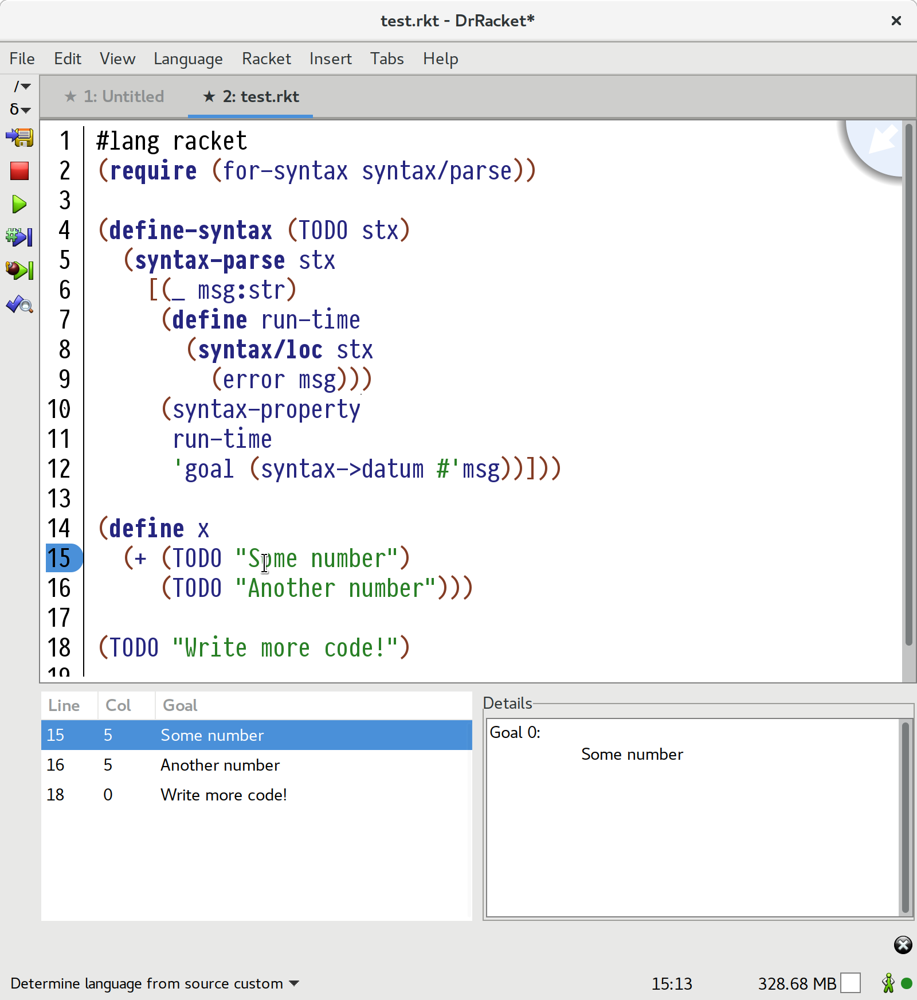
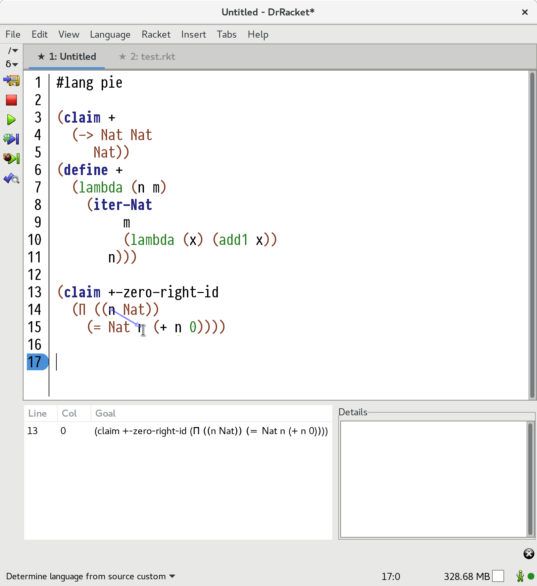

# To-Do List for Macros
==========================

This Racket package contains a DrRacket tool that displays a list of the unwritten parts of a program, as determined by the macros that implement those unwritten parts.

In particular, when Check Syntax finds a syntax object during expansion with the `'goal` syntax property, then it considers that syntax object to be an unsolved goal. After expansion, a panel pops up with a list of goals to be completed.

This tool is intended for use with cooperating languages, especially statically typed languages and proof assistants. It is inspired by the hole list in the [Agda](http://wiki.portal.chalmers.se/agda/pmwiki.php) mode for Emacs.

If you're interested in adding holes to your own language, then this tool is worth a try. To use it, run `rack pkg install -n todo-list` in the directory where it is checked out. Then, in DrRacket, open `demo.rkt` for a very simple hole macro.

I'm interested in feedback from authors of languages with holes on what kinds of customization will make this tool more useful.

## Screenshots

## Thanks

The code that interacts with Check Syntax is based on [refactoring tool code from an LWC 2016 paper](https://github.com/dfeltey/lwc2016) that describes an implementation of a small Java-like language in Racket. I would like to thank Daniel Feltey, Spencer P. Florence, Tim Knutson, Vincent St-Amour, Ryan Culpepper, Matthew Flatt, Robby Findler, and Matthias Felleisen for their great demo of what is possible in Racket!
